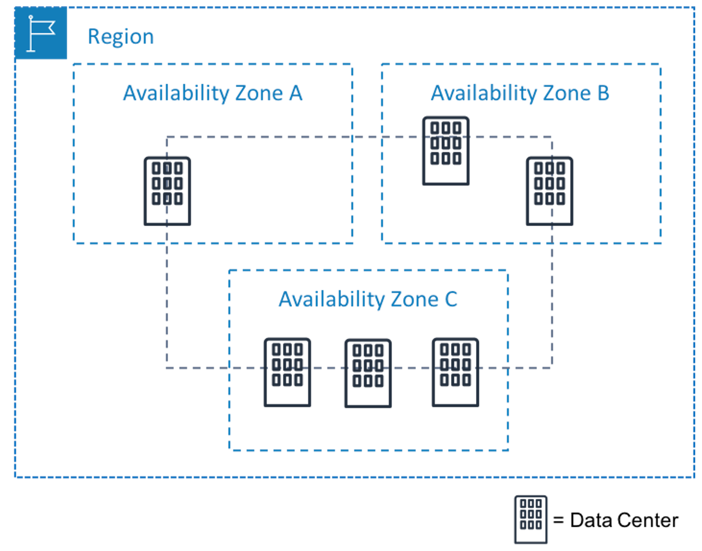
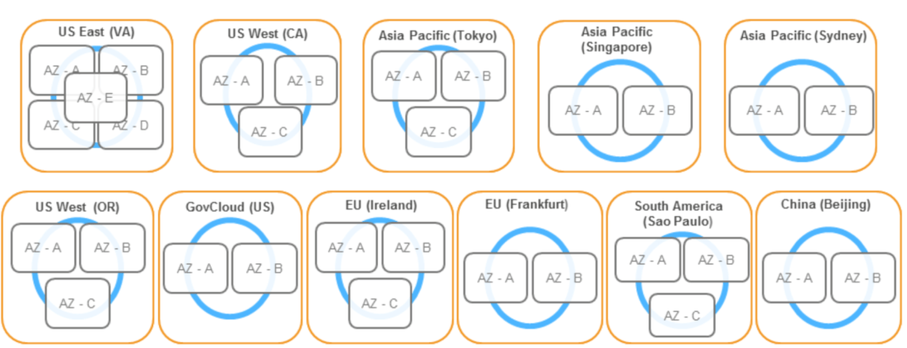
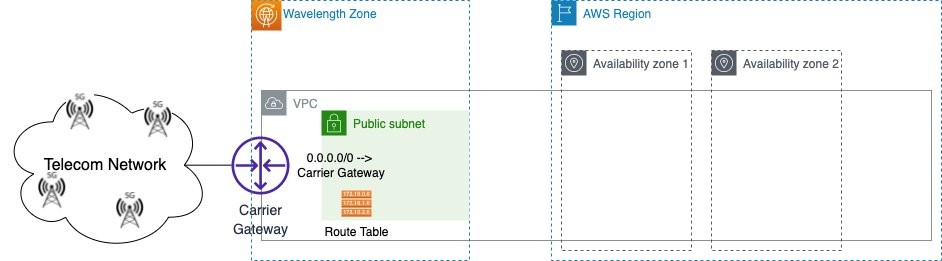
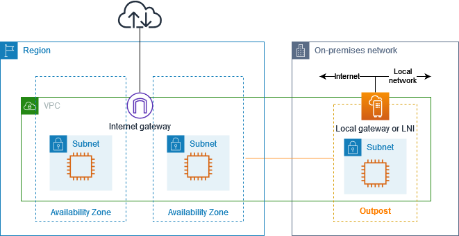
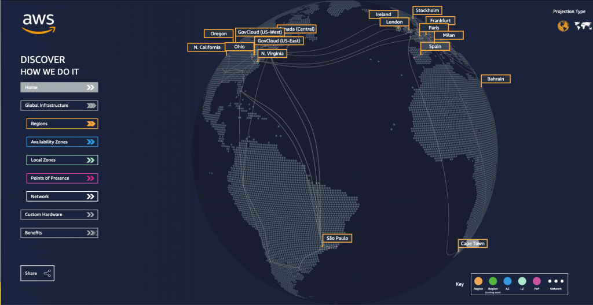

# A Amazon AWS

## Infraestrutura da Amazon Web Services (AWS)

## Regiões da AWS: 

A AWS opera em várias regiões geográficas ao redor do mundo. Cada região é uma área geograficamente isolada que contém várias zonas de disponibilidade. Exemplos de regiões incluem US East (Norte da Virgínia), Europa (Irlanda) e Ásia-Pacífico (Tóquio). As regiões são projetadas para isolamento geográfico e oferecem alta disponibilidade.

## Zonas de Disponibilidade (AZs):

Dentro de cada região, existem várias zonas de disponibilidade (AZs). Cada AZ é um data center independente com sua própria infraestrutura de energia, resfriamento e rede. As AZs são isoladas umas das outras para garantir a resiliência. Os clientes podem distribuir aplicativos em várias AZs para alta disponibilidade.

## Zonas Locais (Local Zones): 

As Zonas Locais são extensões das regiões da AWS e são projetadas para oferecer baixa latência a cidades específicas. Elas permitem que os clientes executem aplicativos próximos aos usuários finais para melhorar o desempenho. As Zonas Locais estão disponíveis em algumas áreas metropolitanas.

## AWS Wavelength: 

O AWS Wavelength é um serviço que estende as zonas de disponibilidade da AWS para as instalações de telecomunicações de operadoras de rede. Isso permite que os clientes executem aplicativos de baixa latência e sensíveis ao tempo em redes 5G. O AWS Wavelength está disponível em colaboração com operadoras de telecomunicações em várias cidades.

## AWS Outposts: 

O AWS Outposts é uma extensão da infraestrutura da AWS que permite que os clientes executem serviços e cargas de trabalho na infraestrutura local, em seus próprios data centers. Os Outposts são totalmente gerenciados pela AWS e permitem a integração com a nuvem pública. Isso é útil para cargas de trabalho que precisam residir localmente devido a requisitos regulatórios ou baixa latência.

## Rede Global: 

A AWS possui uma rede global de alta velocidade que interconecta todas as suas regiões, zonas de disponibilidade e zonas locais. Isso permite a transferência rápida e confiável de dados entre os serviços da AWS e os clientes.

## Infraestrutura de Data Centers: 

A AWS mantém data centers em suas regiões e zonas de disponibilidade para hospedar serviços e recursos. Esses data centers são altamente seguros, com medidas rigorosas de controle de acesso e monitoramento de segurança.

