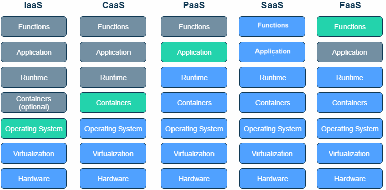
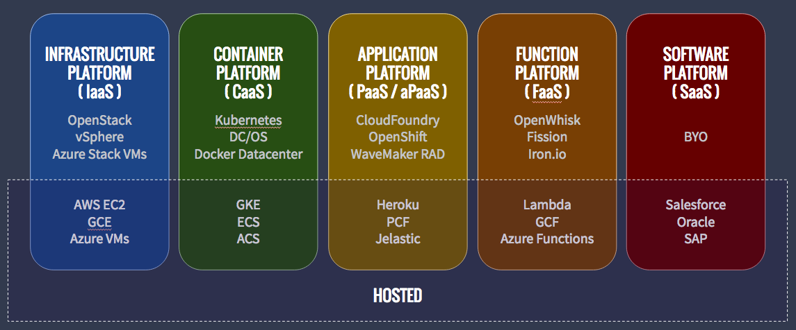
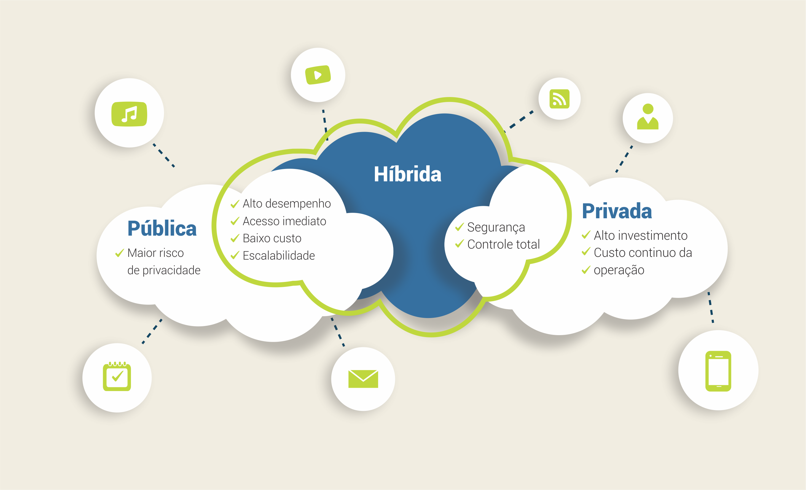
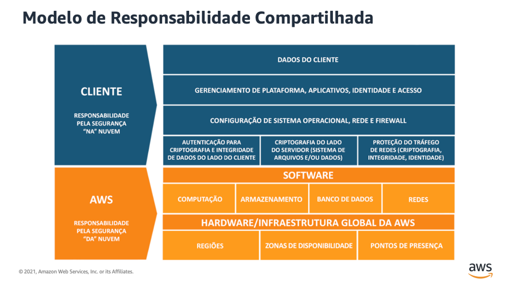

# Os Conceitos de Cloud Computing

Cloud Computing, ou Computação em Nuvem, é um modelo de prestação de serviços de computação que permite o acesso a recursos de computação, como servidores, armazenamento, bancos de dados, redes, software e muito mais, pela internet. Em vez de hospedar esses recursos em servidores locais ou em data centers próprios, as organizações podem alugá-los de provedores de serviços em nuvem.

A computação em nuvem é caracterizada por algumas características-chave:

### Acesso pela Internet:

Os recursos em nuvem são acessados remotamente pela internet. Isso elimina a necessidade de infraestrutura local.

### Escalabilidade:
Os serviços em nuvem geralmente oferecem a capacidade de dimensionar recursos para cima ou para baixo de acordo com as necessidades do usuário. Isso permite que as empresas paguem apenas pelo que usam.

### Serviço Sob Demanda:
Os recursos em nuvem são provisionados e gerenciados conforme necessário. Os usuários podem solicitar e implantar recursos rapidamente.

### Compartilhamento de Recursos:
Os recursos em nuvem são compartilhados por vários usuários e organizações em uma infraestrutura comum. Isso leva a uma maior eficiência e utilização de recursos.

### Gerenciamento Centralizado:
A gestão dos recursos em nuvem é geralmente centralizada, facilitando a administração e a manutenção.

## Os modelos de serviço em nuvem mais comuns incluem:

### IaaS (Infraestrutura como Serviço):
- **O que é**: IaaS fornece uma infraestrutura de computação básica pela internet. Isso inclui máquinas virtuais, armazenamento, redes e sistemas operacionais.
- **Características**:
    - **Controle**: Os usuários têm controle total sobre o sistema operacional, aplicativos e configuração.
    - **Escalabilidade**: É possível dimensionar recursos para cima ou para baixo conforme necessário.
    - **Responsabilidade**: Os provedores de IaaS gerenciam a infraestrutura física, como servidores e data centers.
- **Exemplo**: Amazon Web Services (AWS) Elastic Compute Cloud (EC2) é um serviço IaaS que oferece máquinas virtuais escaláveis.

### PaaS (Plataforma como Serviço):
- **O que é**: PaaS oferece uma plataforma completa de desenvolvimento e implantação pela internet. Isso inclui sistemas operacionais, servidores de aplicativos e ferramentas de desenvolvimento.
- **Características**:
    - **Foco no Desenvolvimento**: Os usuários podem se concentrar no desenvolvimento de aplicativos, enquanto a infraestrutura é gerenciada pelo provedor.
    - **Produtividade**: Facilita o desenvolvimento, teste e implantação de aplicativos.
    - **Escalabilidade**: A escalabilidade é tratada pelo provedor.
- **Exemplo**: Heroku é uma plataforma PaaS que facilita o desenvolvimento e implantação de aplicativos web.

### SaaS (Software como Serviço):
- **O que é**: SaaS oferece aplicativos de software pela internet em vez de instalá-los localmente. Os usuários acessam os aplicativos por meio de navegadores da web.
- **Características**:
    - **Facilidade de Uso**: Os aplicativos são prontos para uso e geralmente não requerem instalação.
    - **Acessibilidade**: Os aplicativos SaaS são acessíveis de qualquer lugar com conexão à internet.
    - **Atualizações Automáticas**: As atualizações de software são gerenciadas pelo provedor.
- **Exemplo**: Google Workspace (anteriormente G Suite) é um conjunto de aplicativos de produtividade SaaS, incluindo Gmail, Google Docs e Google Sheets.

### DaaS (Desktop as a Service):
- **O que é**: DaaS oferece desktops virtuais pela nuvem. Isso permite que os usuários acessem um ambiente de desktop completo pela internet.
- **Características**:
    - **Mobilidade**: Os usuários podem acessar seus desktops de qualquer dispositivo com conexão à internet.
    - **Gerenciamento Centralizado**: Os administradores podem gerenciar desktops virtualizados de forma centralizada.
    - **Segurança**: Os dados e aplicativos estão centralizados em data centers seguros.
- **Exemplo**: Amazon WorkSpaces é um serviço DaaS oferecido pela AWS.

### FaaS (Funções como Serviço):
- **O que é**: FaaS permite que os desenvolvedores executem funções individuais em resposta a eventos, sem se preocupar com a infraestrutura subjacente.
- **Características**:
    - **Escalabilidade Automática**: As funções são escaladas automaticamente em resposta a eventos.
    - **Cobrança Granular**: Os usuários são cobrados apenas pelo tempo de execução das funções.
    - **Simplificação do Desenvolvimento**: Os desenvolvedores podem se concentrar no código da função, sem gerenciar servidores.
- **Exemplo**: AWS Lambda é um serviço FaaS fornecido pela AWS.

### BaaS (Backend as a Service):
- **O que é**: BaaS oferece serviços de backend prontos para uso para aplicativos móveis e web, como autenticação, armazenamento de dados e notificações.
- **Características**:
    - **Desenvolvimento Rápido**: Os desenvolvedores podem economizar tempo usando serviços de backend pré-construídos.
    - **Escalabilidade**: BaaS geralmente escala automaticamente para lidar com o crescimento do aplicativo.
    - **Integração Fácil**: Integração simples com aplicativos móveis e web.
- **Exemplo**: Firebase, da Google, é um serviço BaaS popular.

### CaaS (Containers as a Service):
- **O que é**: CaaS fornece plataformas para criar, implantar e gerenciar contêineres, como Docker, pela nuvem.
- **Características**:
    - **Isolamento de Aplicativos**: Contêineres oferecem isolamento de aplicativos e recursos.
    - **Orquestração**: Ferramentas como Kubernetes ajudam a orquestrar contêineres em grande escala.
    - **Portabilidade**: Contêineres são portáteis entre ambientes de nuvem e locais.
- **Exemplo**: Amazon Elastic Kubernetes Service (EKS) é um serviço CaaS oferecido pela AWS.

  

## Tipos de Nuvem

### Nuvem Privada:

- **O que é**: Uma nuvem privada é uma infraestrutura de nuvem usada exclusivamente por uma única organização. Pode ser hospedada internamente ou por um provedor de serviços em nuvem dedicado.

- **Características**:
    - **Isolamento**: A nuvem privada oferece maior controle e isolamento dos recursos em comparação com outros modelos.
    - **Segurança Personalizada**: A organização pode personalizar a segurança e as políticas de conformidade de acordo com suas necessidades.
    - **Desempenho Previsível**: Os recursos são dedicados, proporcionando desempenho mais previsível.

- **Cenários de Uso**: As nuvens privadas são adequadas para organizações que lidam com dados sensíveis ou que precisam de alto controle sobre sua infraestrutura de TI. Setores regulamentados, como saúde e finanças, frequentemente optam por nuvens privadas.

### Nuvem Pública:

- **O que é**: Uma nuvem pública é uma infraestrutura de nuvem compartilhada por várias organizações. Os recursos são oferecidos como serviços por provedores de nuvem e acessíveis pela internet.

- **Características**:
    - **Compartilhamento de Recursos**: Os recursos em nuvem são compartilhados por várias organizações, resultando em custos mais baixos.
    - **Elasticidade**: Os usuários podem escalar recursos conforme necessário.
    - **Facilidade de Uso**: A implantação é rápida, e os serviços são fáceis de acessar.

- **Cenários de Uso**: A nuvem pública é amplamente utilizada por empresas de todos os tamanhos para uma variedade de cargas de trabalho, desde hospedagem de sites até análise de dados em larga escala.

### Nuvem Híbrida:

- **O que é**: A nuvem híbrida é uma combinação de nuvem privada e pública, permitindo que dados e aplicativos sejam compartilhados entre elas.

- **Características**:
    - **Flexibilidade**: A organização pode aproveitar os benefícios da nuvem privada para cargas de trabalho sensíveis e da nuvem pública para cargas de trabalho menos sensíveis.
    - **Integração**: Os ambientes de nuvem privada e pública podem ser integrados para oferecer maior eficiência e continuidade dos negócios.
    - **Escalabilidade**: A nuvem híbrida permite escalabilidade de recursos conforme necessário.

- **Cenários de Uso**: A nuvem híbrida é usada quando uma organização deseja equilibrar a necessidade de controle sobre dados críticos e a flexibilidade de recursos escaláveis da nuvem pública.

## Modelo de Responsabilidade Compartilhada na Nuvem

- **O que é**: Na AWS, o modelo de responsabilidade compartilhada é um conceito fundamental que define as responsabilidades de segurança entre a AWS (provedor de serviços em nuvem) e os clientes da AWS.

- **AWS (Provedor de Serviços em Nuvem)**:
    - A AWS é responsável pela segurança da infraestrutura global subjacente, incluindo data centers, servidores, redes e sistemas de armazenamento.
    - A AWS também fornece serviços de segurança, como AWS Identity and Access Management (IAM), AWS Key Management Service (KMS) e Amazon VPC (Virtual Private Cloud).
    - A AWS garante a disponibilidade e a confiabilidade de seus serviços.
        
        - **Exemplo de Responsabilidades**:
            - Proteger a infraestrutura física dos data centers.
            - Manter a segurança da rede e da infraestrutura subjacente.
            - Oferecer serviços de segurança gerenciados, como AWS GuardDuty para detecção de ameaças e AWS WAF (Web Application Firewall).

- **Cliente AWS**:
    - Os clientes da AWS são responsáveis pela segurança de seus próprios dados e cargas de trabalho na nuvem AWS.
    - Isso inclui configurar permissões de acesso adequadas, proteger dados confidenciais usando criptografia, gerenciar identidades e acessos de usuários e garantir a segurança de aplicativos e sistemas implantados na AWS.
        
        - **Responsabilidades do Cliente**:
            - Configurar permissões de acesso usando AWS IAM.
            - Implementar a criptografia adequada para proteger dados em repouso e em trânsito.
            - Gerenciar identidades e acessos de usuários com base nas políticas de segurança da organização.
            - Desenvolver aplicativos seguros e manter a segurança de sistemas implantados na AWS.

- **Importância**:
    - O modelo de responsabilidade compartilhada na AWS ajuda a esclarecer as responsabilidades de segurança, garantindo que tanto a AWS quanto os clientes desempenhem papéis específicos na proteção dos dados e sistemas.

- **Revisão Regular**:
    - As responsabilidades devem ser revisadas regularmente para garantir a segurança contínua na nuvem AWS.
