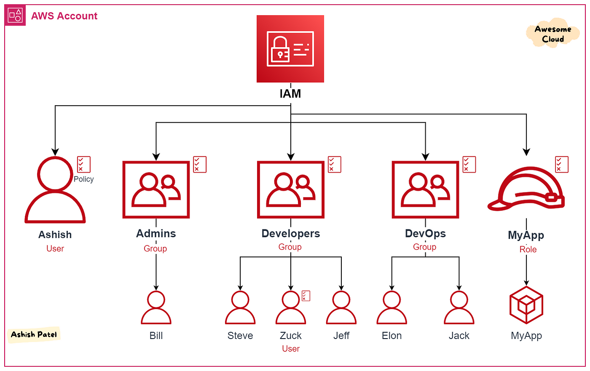
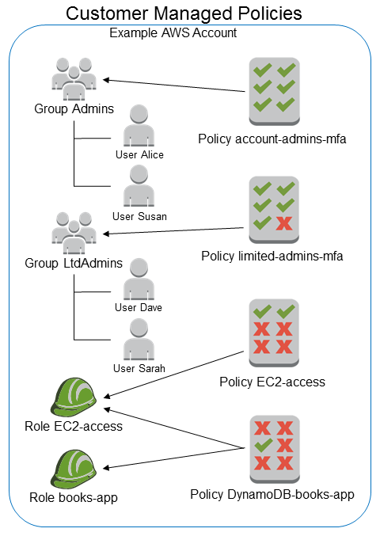
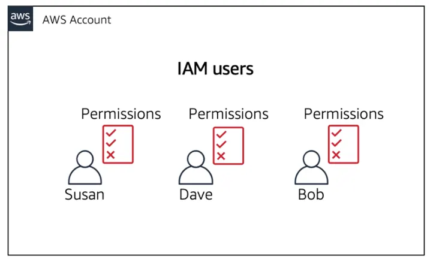
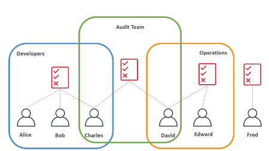
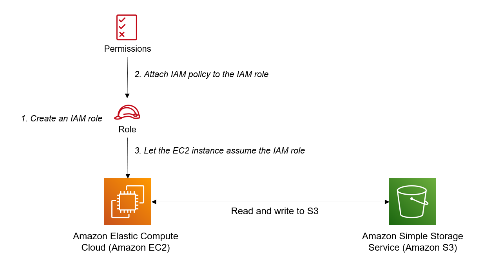
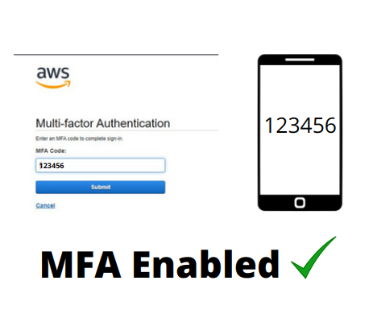
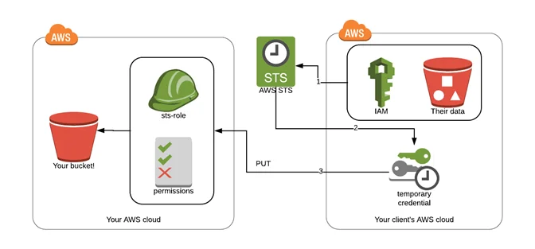
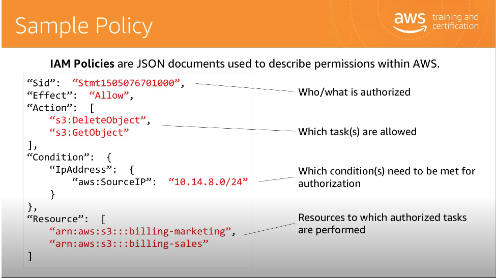

# Introdução ao AWS Identity and Access Management (IAM)

O AWS Identity and Access Management (IAM) é um serviço fundamental na Amazon Web Services (AWS) que permite o gerenciamento de identidades e o controle de acesso a recursos na nuvem. Aqui estão os principais conceitos relacionados ao IAM:

## Usuários, Grupos e Políticas

- **Usuários**: Representam pessoas ou serviços que interagem com a AWS. Cada usuário possui suas próprias credenciais de login.
  

- **Grupos**: São coleções lógicas de usuários. As políticas são associadas a grupos para conceder permissões.
  

- **Políticas**: Definem as permissões que os usuários e grupos têm. Elas são escritas em JSON e podem ser anexadas a usuários, grupos ou recursos.
  

## Processo de Autenticação
  

- A autenticação no IAM envolve a verificação da identidade de um usuário ou serviço. Isso pode ser feito por meio de senhas, chaves de acesso, tokens ou outras formas de autenticação.

## MFA (Autenticação de Multifator)
  

- O MFA adiciona uma camada extra de segurança, exigindo que os usuários forneçam duas ou mais formas de identificação antes de acessar recursos críticos.

## Utilizando o Security Token Service (STS)
  

- O STS permite a geração de tokens temporários que concedem acesso aos recursos da AWS. Isso é útil para cenários de acesso temporário.

## Políticas de Recurso e Identidade

- As políticas de recurso controlam o acesso a recursos específicos, como buckets S3 ou instâncias EC2.

- As políticas de identidade controlam o que os usuários e grupos podem fazer no IAM, como criar usuários ou definir políticas.

## Estrutura das Políticas
  

- As políticas são estruturadas em JSON e contêm elementos como "Effect" (Permitir ou Negar), "Action" (Ação permitida) e "Resource" (Recurso afetado).

## Boas Práticas para o IAM

- Princípio do menor privilégio: Conceda apenas as permissões necessárias para realizar uma tarefa específica.

- Rotação de credenciais: Faça a rotação regular de senhas e chaves de acesso para aumentar a segurança.

- Auditoria e monitoramento: Utilize ferramentas como AWS CloudTrail para rastrear atividades e revisar registros regularmente.

- Implemente MFA sempre que possível para proteger contas críticas.

- Siga as melhores práticas de segurança da AWS para manter sua infraestrutura segura.
